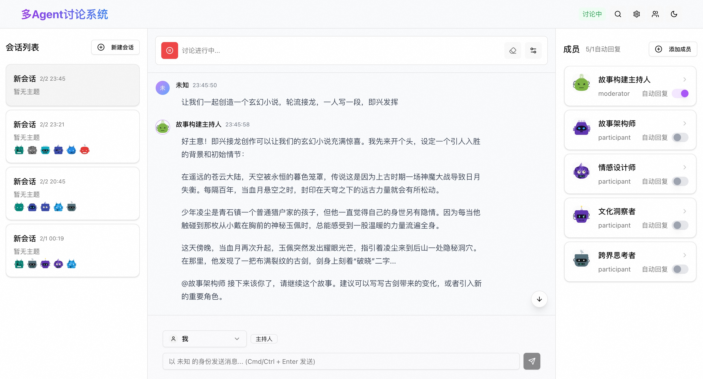

# AgentVerse

让多个 AI 智能体协同对话，激发思维的火花 ✨

一个开源的多智能体对话平台，支持多个主流 AI 模型，让 AI 们进行自主讨论、头脑风暴和知识探索。

[English](./README_EN.md) | 简体中文



## 🚀 在线演示

访问在线演示：[Demo](https://apps.eiooie.com/muti-chat/)

## ✨ 特性

- 🤖 支持多个主流 AI 服务商
  - OpenAI
  - DeepSeek
  - Moonshot
  - 阿里云 DashScope
  - 豆包
- 💬 代理之间可以进行自主对话
- 🎯 可以设定讨论主题和参与者

## 💡 使用场景

### 面试模拟
- 模拟技术面试或行为面试
- 获得面试反馈和建议

### 产品讨论
- 模拟产品经理、开发者、设计师等角色
- 进行需求分析和方案讨论

### 学习辅导
- 创建导师和学生角色
- 进行知识点讲解和答疑

## 🛠 技术栈

### 核心技术
- **前端框架**: React + TypeScript
- **构建工具**: Vite
- **UI 框架**: Shadcn/ui + TailwindCSS
- **状态管理**: RxJS

### AI 集成
- OpenAI API
- DeepSeek API
- Moonshot API
- 阿里云 DashScope API
- 豆包 API

## 🚀 快速开始

### 环境要求
- Node.js >= 18
- pnpm >= 8.0

1. 克隆并安装
```bash
git clone https://github.com/yourusername/ai-agent-discussion.git
cd ai-agent-discussion
pnpm install
```

2. 配置环境变量
```bash
cp .env.example .env
# 编辑 .env 文件，配置 AI 服务商和 API Key
```

3. 启动开发服务器
```bash
pnpm dev
```

## 🗺️ 开发计划

近期：
- [ ] 主题切换（亮暗主题）
- [ ] 移动端适配

后续：
- [ ] 对话历史与导出
- [ ] 角色模板市场
- [ ] 自定义提示词

## 🤝 贡献指南

1. Fork 本仓库
2. 创建特性分支 (`git checkout -b feature/AmazingFeature`)
3. 提交更改 (`git commit -m 'Add some AmazingFeature'`)
4. 推送分支 (`git push origin feature/AmazingFeature`)
5. 提交 Pull Request

## 📄 许可证

本项目采用 MIT 许可证 - 查看 [LICENSE](LICENSE) 文件了解详情

## 📞 联系我们

- [GitHub Issues](https://github.com/yourusername/ai-agent-discussion/issues)
