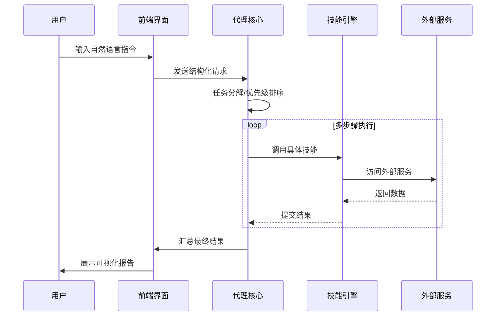
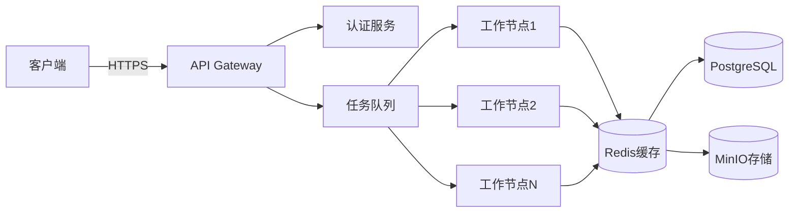

# DeepSeek R1 Agent 架构设计文档

## 1. 整体架构

## 2. 核心组件

| 模块            | 职责                          | 技术栈                  |
|-----------------|-----------------------------|-----------------------|
| 交互层(UI)       | 用户指令输入/结果展示              | React + shadcn/ui     |
| 代理核心(Agent)  | 任务分解/决策调度                 | Zustand + RxJS        |
| 技能引擎(Skills) | 具体能力实现（搜索/分析/操作）         | Node.js + TypeScript  |
| 记忆系统(Memory) | 短期记忆/长期知识库                | IndexedDB + LokiJS    |
| 接口层(API)      | 内外系统通信                    | Fastify + Protobuf    |
| 安全层(Security) | 权限控制/输入过滤                 | JWT + Content-Security|

## 3. 数据流设计



### 三、部署架构

```markdown
## 基础设施规划



### 四、开发路线调整

1. **阶段 0：设计验证**
   - [ ] 完成接口原型设计
   - [ ] 制作用户旅程地图
   - [ ] 关键技术验证(PoC)

2. **阶段 1：核心实现**
   - [ ] 实现Agent状态机
   - [ ] 开发调试控制台
   - [ ] 构建基础技能集

3. **阶段 2：系统集成**
   - [ ] 实现分布式任务队列
   - [ ] 集成监控系统
   - [ ] 完成安全审计

需要我详细解释哪个部分？或是需要提供哪些具体的设计文档模板？我们可以使用Swagger进行API设计，用PlantUML做架构图，这些都能很好集成到文档系统中。
